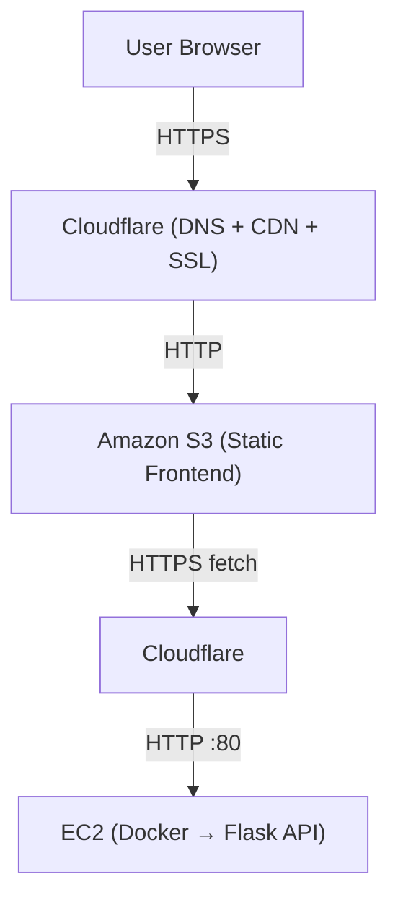

# CloudForge Portfolio — Architecture

## Overview

CloudForge Portfolio is a full-stack, cloud-native portfolio platform designed to demonstrate modern DevOps practices, containerization, CI/CD automation, and cloud infrastructure.

The system consists of:
- A globally distributed static frontend
- A containerized Python backend API
- Automated CI and CD pipelines
- Cloud-managed DNS and HTTPS

---

## High-Level Architecture

Frontend:
- Static website hosted on Amazon S3
- Served globally via Cloudflare CDN
- HTTPS enforced using Cloudflare SSL

Backend:
- Flask-based REST API
- Containerized using Docker
- Deployed on an Amazon EC2 instance
- Exposed via a custom subdomain

CI/CD:
- GitHub Actions for CI and CD
- Docker Hub as container registry
- Automated deployment via SSH

---

## Architecture Diagram (Logical)

## Architecture Diagram

---

## Key Design Decisions

### Why S3 + Cloudflare for Frontend
- Zero server maintenance
- Globally cached content
- HTTPS on custom domain
- Extremely low cost

### Why EC2 + Docker for Backend
- Full control over runtime
- No platform lock-in
- Simple mental model
- Production-like deployment

### Why Separate CI and CD Pipelines
- CI validates and builds artifacts
- CD deploys only approved images
- Prevents race conditions
- Mirrors real-world DevOps practices

---

## Security Considerations

- SSH access is key-based only
- No passwords enabled
- Backend runs inside a container
- Public exposure limited to required ports
- HTTPS enforced at the edge (Cloudflare)

---

## Scalability Notes

This architecture can be extended by:
- Adding a load balancer
- Moving backend to ECS/EKS
- Introducing environment-based configs
- Adding monitoring and logging

---

## Summary

CloudForge Portfolio demonstrates a production-style architecture with clear separation of concerns, automated deployments, and cloud-native principles, while remaining simple enough for individual ownership and iteration.