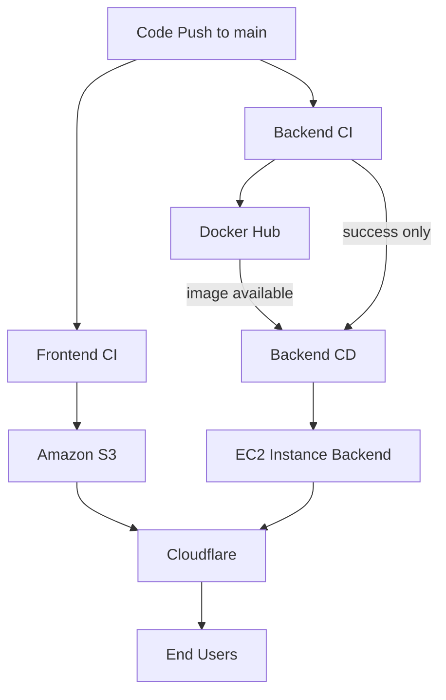

# CloudForge Portfolio — CI/CD Pipeline

## Overview

CloudForge Portfolio uses a fully automated CI/CD pipeline built with GitHub Actions to deploy both frontend and backend components.

The system intentionally separates:
- Frontend Continuous Integration (CI)
- Backend Continuous Integration (CI)
- Backend Continuous Deployment (CD)

This separation prevents race conditions and guarantees that only validated artifacts
are deployed to production.
It ensures safe, deterministic, and production-grade deployments.

---

## Pipeline Stages

### Frontend Continuous Integration (CI)

#### Purpose

The frontend is a static website. Its CI pipeline is responsible for deploying
static assets to cloud storage without requiring a runtime server.

#### Workflow

Workflow file:
`.github/workflows/frontend-ci.yml`

Responsibilities:
- Sync frontend files to Amazon S3
- Ensure the latest version is publicly available
- Serve content globally via Cloudflare CDN

Triggers:
- Pushes to the `main` branch
- Changes under the `frontend/` directory

#### Deployment Flow

GitHub → Frontend CI → Amazon S3 → Cloudflare → Users

---

### Backend Continuous Integration (CI)

#### Purpose

Backend CI validates code and produces a deployable Docker image
without interacting with production infrastructure.

#### Workflow

Workflow file:
`.github/workflows/backend-ci.yml`

Responsibilities:
- Run backend tests
- Build Docker image
- Push Docker image to Docker Hub

CI runs on:
- Every push
- Every pull request

CI ensures that:
- Code is valid
- Tests pass
- A deployable Docker image exists

CI guarantees that only valid, tested images are eligible for deployment.

---

### Backend Continuous Deployment (CD)

#### Purpose

Backend CD deploys **only validated Docker images** to the production environment.

#### Workflow

Workflow file:
`.github/workflows/backend-cd.yml`

Responsibilities:
- Deploy the backend to the production EC2 instance
- Pull the latest approved Docker image
- Restart the backend container on EC2 safely
- Ensure service continuity

CD runs:
- Only after Backend CI completes successfully
- Only for changes merged into the main branch

---

## CI → CD Gating Mechanism

The Backend CD workflow is gated using GitHub Actions `workflow_run`.

Deployment triggers **only when the CI workflow concludes with success**.

This guarantees:
- No deployment on failed builds
- No deployment of partially built or stale images
- No race conditions between build and deploy stages

---

## CI/CD Flow Diagram



---

## Backend Deployment Strategy

Deployment to EC2 is performed via SSH using a dedicated deploy key.

### Steps excecuted during deployment:

1. Pull the latest Docker image from Docker Hub
2. Stop the running backend container (if present)
3. Remove the old container
4. Start a new container with restart policy enabled

The backend container:
- Listens on port 5000 internally
- Is exposed via port 80 on the EC2 instance
- Uses restart policy ```unless-stopped```

---

## Why this CI/CD Design?

This CI/CD design reflects real-world DevOps practices by:
- Separating validation and deployment responsibilities
- Treating Docker images as immutable artifacts
- Enforcing strict CI → CD gating
- Avoiding deployment race conditions
- Keeping infrastructure simple and auditable

---

## Summary

The CloudForge CI/CD pipelines demonstrate a production-style automation setup with clear separation of concerns, gated deployments, and cloud-native principles applied to both frontend and backend services.